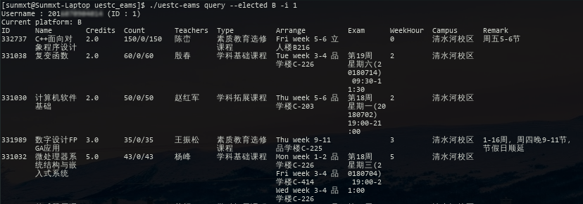

# **UESTC-EAMS**

[](https://travis-ci.org/Sunmxt/UESTC-EAMS/) [](https://codecov.io/gh/Sunmxt/UESTC-EAMS/) [](https://www.python.org/) [](https://github.com/Sunmxt/UESTC-EAMS/blob/master/LICENSE)

---

#### 简介

简单易用的第三方 UESTC 教务系统接口。

计划完成的功能：

- [x] 认证模块
- [x] 选课接口
- [x] 简单的 CLI 工具
- [ ] 课程信息查询
- [ ] 查询课表
- [ ] 考试信息
- [ ] 抢课（CLI） 

*依赖的三方库：* **requests**

---

#### 安装(Installation)

```
git clone https://github.com/Sunmxt/UESTC-EAMS.git
```

---

#### 文档 (Documentation)

使用方法及相关信息可参考 [GitHub Wiki](https://github.com/Sunmxt/UESTC-EAMS/wiki)

---

### CLI



```
$ ./uestc-eams 
Access to UESTC EAMS system. 

Usage: %s <command> [options] < <username> -p <password> | -i account_id>

Command:
    login       <account> [options]             Login with account.
    logout      <account_id>                    Logout.
    query                                       Query information
    elect                                       Elect course.

Common options:
    -p  --password                              Specified account password.
    -i  --id                <account_id>        Specified account ID to logout.

login options:
        --no-persist                            Do not keep login state.

query options:
        --account                               List logined accounts.
        --elect-platform                        List available course electing platform.
        --electable         <platform_id>       List available courses in specified electing platform.
        --elected           <platform_id>       List elected platform.

elect options:
    -I  --course-id         <course_id>         Course ID to elect.
    -d  --cancel            <course_id>         Cancel election of specified course.
    -P  --platform          <platform_id>       Specified platform.
    -f  --force                                 Force to Elect. (experimental)
```

